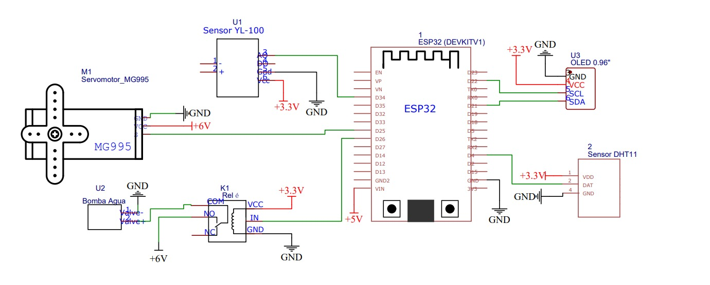
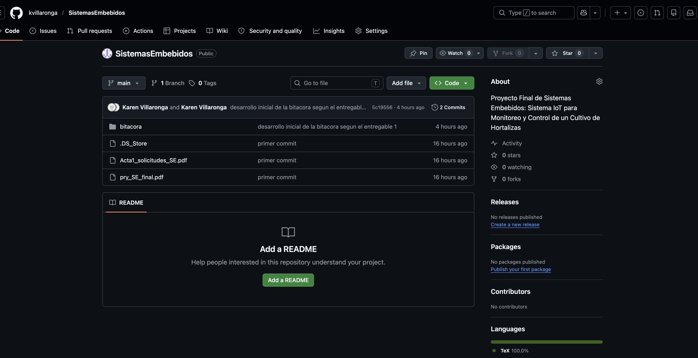
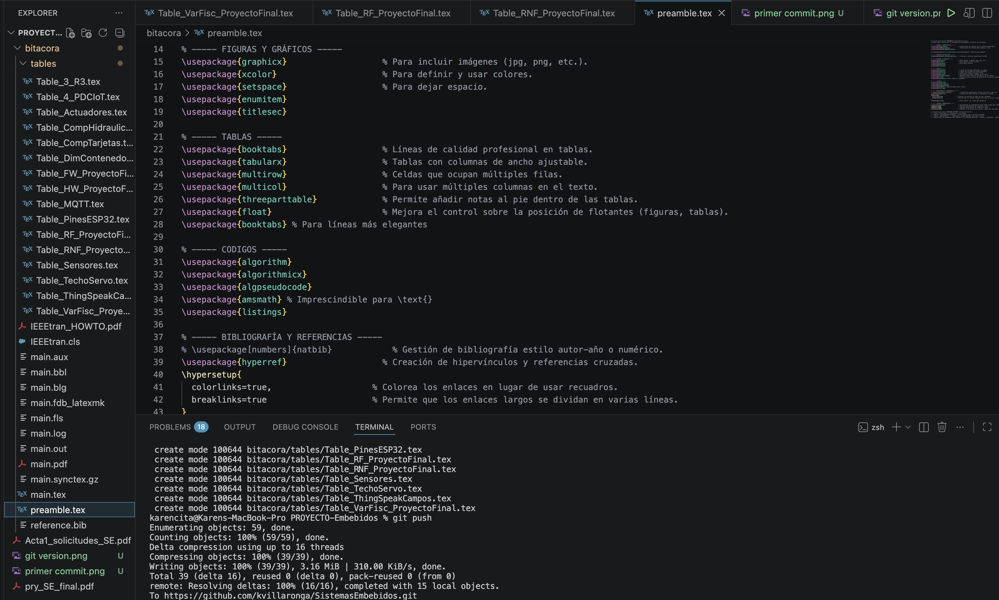
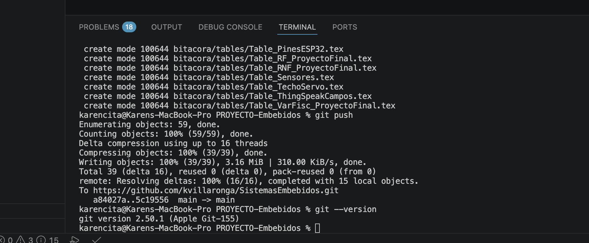
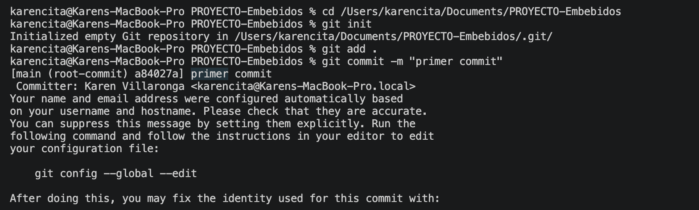
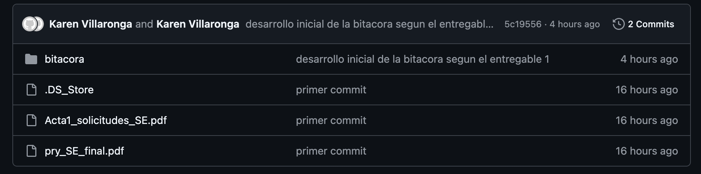
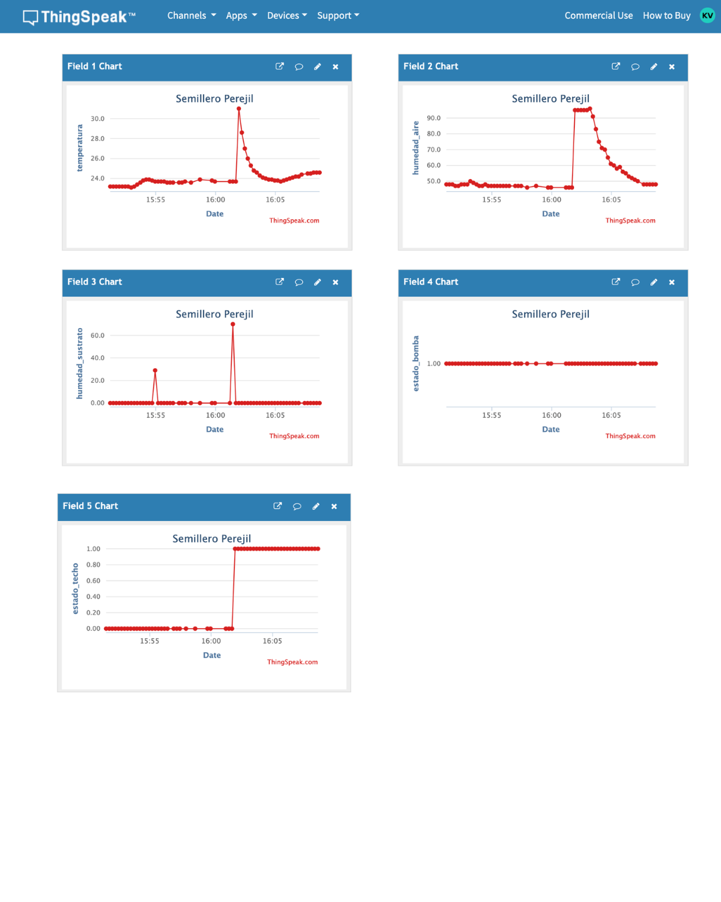
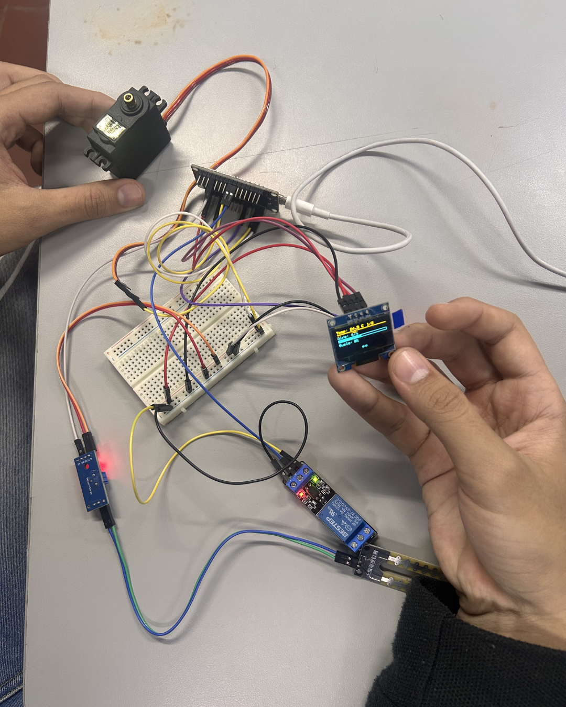

# Sistema de Riego Automático con Techo Móvil
**Curso:** Sistemas Embebidos  
**Grupo:** G5  
**Integrantes:** Karen Villaronga, Joseph Suarez  
**Universidad Santo Tomás – Bucaramanga**

---

## Descripción
Sistema embebido IoT para monitoreo y control automático de un semillero de perejil.
Controla humedad del sustrato (riego por goteo), temperatura ambiente (techo móvil)
y publica datos en ThingSpeak vía MQTT.

---

## Diagrama del sistema


---

## Hardware requerido
- ESP32-WROOM
- Sensor DHT11
- Sensor YL-100 (humedad sustrato)
- Servo MG995
- Relé 1 canal
- OLED SSD1306 0.96" I2C
- Bomba sumergible 5V
- Fuente externa 6V para bomba

## Mapa de pines
| Componente   | Pin ESP32 |
|--------------|-----------|
| DHT11 DATA   | GPIO 4    |
| YL-100 AOUT  | GPIO 34   |
| Relé IN      | GPIO 26   |
| Servo SEÑAL  | GPIO 25   |
| OLED SDA     | GPIO 21   |
| OLED SCL     | GPIO 22   |

---

## Librerías utilizadas
| Librería | Versión | Función |
|---|---|---|
| DHT sensor library (Adafruit) | ^1.4.4 | Lectura temperatura y humedad aire |
| Adafruit Unified Sensor | ^1.1.9 | Dependencia de DHT |
| Adafruit SSD1306 | ^2.5.7 | Control pantalla OLED |
| Adafruit GFX Library | ^1.11.9 | Gráficos para OLED |
| ESP32Servo | ^0.13.0 | Control servo MG995 |
| PubSubClient (knolleary) | ^2.8 | Comunicación MQTT con ThingSpeak |

---

## Instalación
1. Clonar el repositorio:
```bash
   git clone https://github.com/kvillaronga/SistemasEmbebidos.git
```
2. Abrir la carpeta `codeArduino/codeProyectoFinal` en VS Code con PlatformIO
3. Completar credenciales en `src/main.cpp`:
```cpp
   const char* WIFI_SSID = "tu_red";
   const char* WIFI_PASS = "tu_contraseña";
   const char* MQTT_USER = "...";
   const char* MQTT_PASS = "...";
   const char* MQTT_CLIENT = "...";
   const char* MQTT_CHANNEL = "channels/TU_ID/publish";
```
4. Conectar el ESP32 por USB
5. Compilar y cargar con el botón **→ Upload** de PlatformIO

---

## Ejecución
1. Una vez cargado el código, abrir el **Serial Monitor** a 115200 baudios
2. El sistema arranca automáticamente:
   - Se conecta al WiFi
   - Se conecta al broker MQTT de ThingSpeak
   - Lee sensores cada 5 segundos
   - Publica en ThingSpeak cada 15 segundos
3. Verificar datos en: `https://thingspeak.com/channels/TU_CHANNEL_ID`

---

## Capturas de funcionamiento








---

## Historial de commits
Ver pestaña [Commits](../../commits/main) en GitHub.